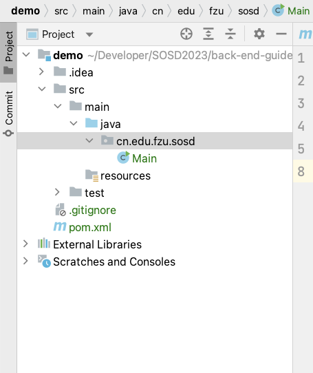
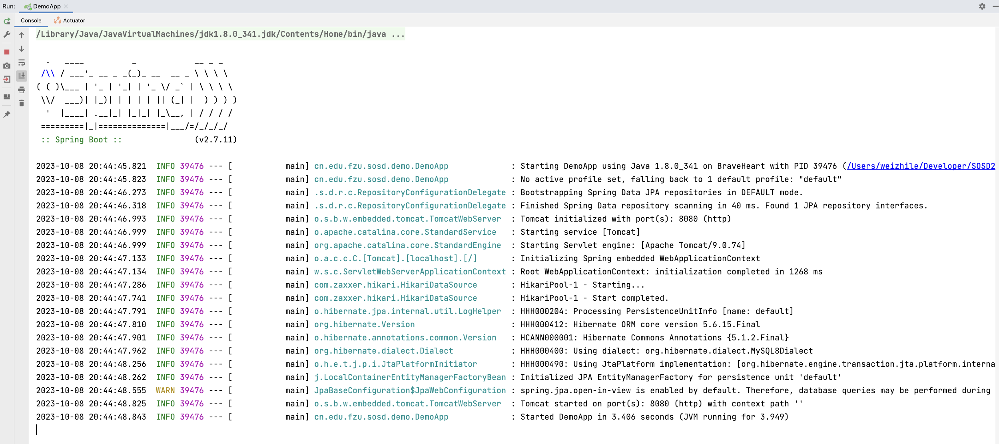
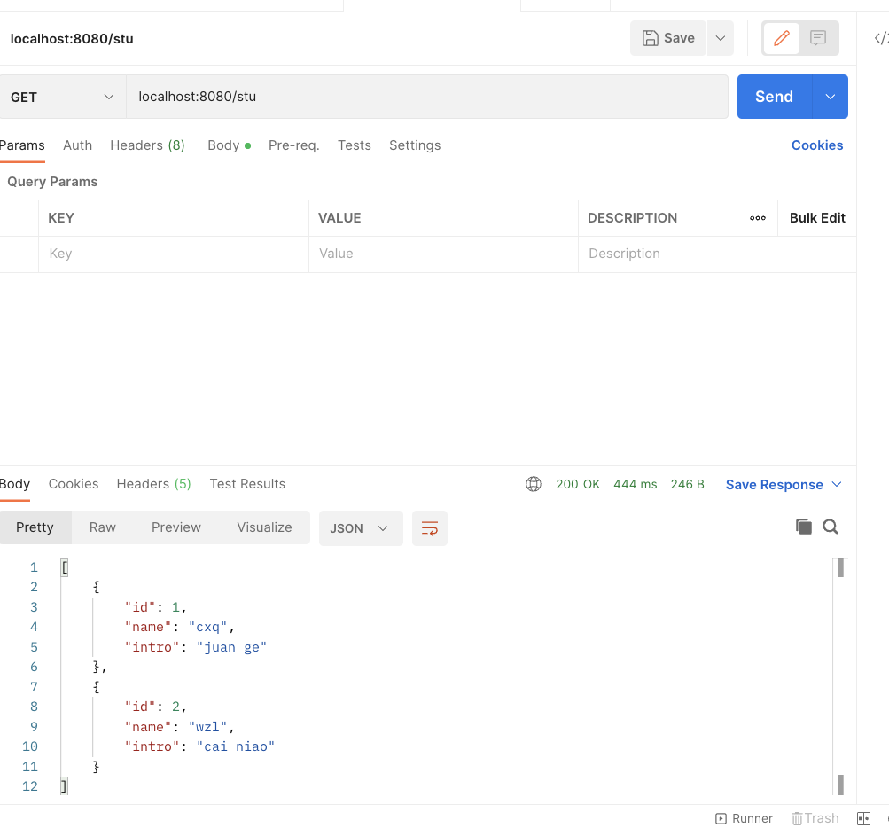

## some words before~

考虑到本次考核(2023-autumn)，招收的后端考核成员大一和大二之间水平差距比较大，但是大一的同学看起来热情比较高~~（比较肯卷）~~，所以为了赶上下学期的服创国赛，我会把考核难度设置得高一点。作为SOSD的一份子，希望你能有自信，能够进入我们实验室，即使只是考核成员，也是你的同学中的佼佼者了。

一直以来，市面上的绝大部分Java后端学习路线似乎都是：

JavaSE -> MySQL -> SpringBoot+SpringMVC+MyBatis -> 实战开发

确实这个路线大致是没问题的，但是实际在学习中，我发现许多身边的人（包括我自己）往往在集成SSM的时候会遇到比较大的困难，大概情况就是：

- 难以完成一个正确的Spring配置或MyBatis配置（看CSDN看的）
- 不知道代码为啥要那么写，只是知道把这段代码复制到这个位置，程序就能很自觉的运行起来，并且达成自己的某个目的。
- 不知道框架到底是做什么的，也不知道框架之间的关系，比如说Spring是怎么和MyBatis集成的？根本想不明白，发现BUG只能活活挨打，复制报错信息到CSDN这个大垃圾堆里面试图找点有用的，听着挺可怜的，不是吗？

所以，结合我们实验室的目的，也就是为竞赛的项目开发一个后端程序，我觉得也许我们的学习路线可以做一些调整，以便于我们更好更快的掌握基础的开发技能，并且为未来更深一步了解Java庞大的生态系统开一个好头。或许我们就走在了真正正确的道路上，如果不是，也没有偏离它太远。

#### Why Spring Data JPA while not MyBatis?

首先不是说MyBatis不行，只是因为它与SpringBoot的集成并没有JPA那么顺滑，并且需要手写SQL语句，对于简单的crud项目，这是没有必要的。也许你会说，MyBatis-plus也能很好的解决这个问题。但我并不认为它是一个很优秀的框架，首先它不支持多主键，它会导致你的项目启动十分缓慢，它并不支持其他的ORM框架，并且过度封装，入侵了service层，并不符合三层架构的构思。

So, why not JPA? 

- Spring Data JPA是Spring生态系统中的一部分，它简化了数据访问层的开发，通过自动生成SQL查询，减少了样板代码的编写。
- 如果你想快速入门并且不想花太多时间编写SQL查询，Spring Data JPA可能更适合你。
- Spring Data JPA提供了一种基于接口的编程模型，使得数据访问层的开发更加方便。

# Before learning, you should know...

- Java-面向对象
- maven的基础使用（引入依赖）
- sql基础增删改查语句的书写

- 对spring框架有基本认识（认识这个IoC容器是在做什么的、有什么用、能怎么用）
- 了解spring boot是怎么"简化"我们的开发过程的，也就是要知道Spring auto configure（自动装配）相关的内容
- 知道ORM框架的含义与作用。

# Guiding for Building up DemoApp

### building framework

首先用IDEA创建一个最简单的maven项目，目录如下：



在pom.xml引入我们需要的依赖：

```xml
<parent>
  <groupId>org.springframework.boot</groupId>
  <artifactId>spring-boot-parent</artifactId>
  <version>2.7.11</version>
</parent>

<dependencies>
  <dependency>
      <groupId>org.springframework.boot</groupId>
      <artifactId>spring-boot-starter-web</artifactId>
    </dependency>
  <dependency>
    <groupId>org.springframework.boot</groupId>
    <artifactId>spring-boot-starter</artifactId>
  </dependency>
  <dependency>
    <groupId>org.springframework.boot</groupId>
    <artifactId>spring-boot-starter-data-jpa</artifactId>
  </dependency>
  <dependency>
    <groupId>mysql</groupId>
    <artifactId>mysql-connector-java</artifactId>
    <version>8.0.25</version>
  </dependency>
</dependencies>
```

然后把我们的项目目录修改成spring-like的结构


然后写好配置文件：

```yml
spring:
  application:
    name: demo
  datasource:
    url: jdbc:mysql://localhost:3306/SOSDJavaCh01?characterEncoding=utf8
    username: root
    password: 123456
  jpa:
    show-sql: true
    hibernate:
      naming:
        physical-strategy: org.hibernate.boot.model.naming.PhysicalNamingStrategyStandardImpl
```

这里的数据源改成自己的就行，没必要跟我一样。如果你想要使用跟这个demo一样的数据源，我留了完整的sql文件在 `./demo/scripts`文件夹下。

### Using Spring Data JPA

使用java的JPA注解做好type和field的标注。并且做好对这个类的封装

```java
@Entity
@Table(name = "Student")
public class Student implements Serializable {

  @Id
  @Column(name = "Id")
  @GeneratedValue(strategy = GenerationType.IDENTITY)
  private Long id;

  @Column(name = "Name")
  private String name;

  @Column(name = "Intro")
  private String intro;
  
  // 封装代码不在此处展示
}
```

然后创建一个jpa的repository

```java
public interface StudentRepository extends JpaRepository<Student, Long> {

  Student findStudentByName(String name);

}
```

把repository的bean注入到service层中，并编写我们需要的逻辑代码

```java
@Service
public class StudentService {

  private final StudentRepository studentRepository;

  public StudentService(StudentRepository studentRepository) {
    this.studentRepository = studentRepository;
  }

  public Student findByName(String name) {
    return studentRepository.findStudentByName(name);
  }

  public Student save(Student student) {
    return studentRepository.save(student);
  }

  public List<Student> findAll() {
    return studentRepository.findAll();
  }

}
```

编写我们的controller层代码，同样将service的bean注册进来，并编写我们需要的接口

```java
@RestController
public class StudentController {

  private final StudentService studentService;

  public StudentController(StudentService studentService) {
    this.studentService = studentService;
  }

  @GetMapping("/stu/name")
  public Student findStuByName(String name) {
    return studentService.findByName(name);
  }

  @PostMapping("/stu")
  public Student registerStu(@RequestBody Student student) {
    return studentService.save(student);
  }

  @GetMapping("/stu")
  public List<Student> findAll() {
    return studentService.findAll();
  }
}
```

现在我们就完成了这个小demo，结构应该如下：


运行起来



### Test by ApiTool (like Postman)

- 查询全部：



- 增加一条：


- 条件查询：


### Congrats! You have built this demo succesfully!

这个demo涵盖了前后端分离形式的MVC架构，ORM操作数据库，RESTful规范接口。

后续的考核作业，扩展延伸都会基于这个demo。组内考核任务会在`assignment`文件夹，请做好准备～
